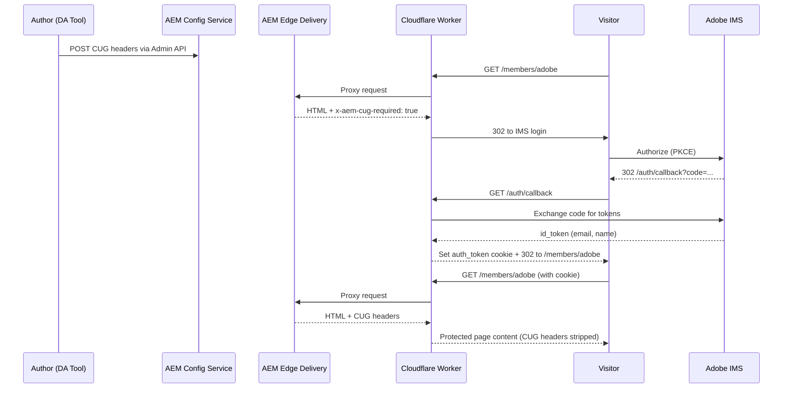

# Building a Gated Portal on AEM Edge Delivery Services: How Summit Does It

Delivering both public marketing pages and members-only content from a single site is a common requirement, but Edge Delivery Services doesn't ship with a built-in access control layer. The [summit-portal](https://github.com/aemsites/summit-portal) project solves this with a pattern we call **Closed User Groups (CUG) at the edge**: access rules are authored in a spreadsheet, attached to pages as HTTP headers via the AEM Config Service, and enforced by a Cloudflare Worker that handles OAuth 2.0 + PKCE against Adobe IMS.

This post walks through every piece of the implementation — spreadsheet authoring, header injection, edge enforcement, session management, and portal redirect — with code straight from the open-source summit-portal repository.

---

## Architecture Overview

The system has three layers, all contained in the [summit-portal](https://github.com/aemsites/summit-portal) repo:

1. **DA authoring tool** — reads a `closed-user-groups` spreadsheet and pushes `x-aem-cug-required` / `x-aem-cug-groups` headers to the AEM Config Service.
2. **AEM Edge Delivery origin** — serves content with CUG headers attached by the Config Service based on URL pattern matching.
3. **Cloudflare Worker** — sits in front of the origin, reads CUG headers from the origin response, enforces authentication via Adobe IMS OAuth + PKCE, checks group membership, and manages JWT sessions.



The key insight is that access rules are data, not code. Authors maintain a spreadsheet; the tool pushes it to the Config Service as HTTP response headers; the Worker reads those headers at the edge and decides whether to serve or gate the page. No origin-side code changes are needed to add or remove a protected path.

---

## Step 1: Define Access Rules with a Spreadsheet

All access rules live in a single spreadsheet named `closed-user-groups` in the site's Document Authoring (DA) workspace. The spreadsheet has three columns:

| url | cug-required | cug-groups |
|-----|-------------|------------|
| `/members/*` | `true` | `adobe.com` |
| `/members/partners/*` | `true` | `adobe.com,partner.com` |
| `/internal/*` | `true` | `adobe.com` |
| `/public/*` | `false` | |

- **url** — the path pattern to match (supports wildcards via Config Service rules).
- **cug-required** — `true` to require authentication, `false` to explicitly mark as public.
- **cug-groups** — comma-separated list of allowed email domains. If empty when `cug-required` is `true`, any authenticated user can access the page.

The spreadsheet is authored in DA and served as JSON at `closed-user-groups.json`. The DA tool reads this JSON and transforms it into Config Service headers.

---

## Step 2: Push Headers to the Config Service (DA Tool)

The CUG tool is a lightweight DA sidebar app at [`tools/cug/`](https://github.com/aemsites/summit-portal/tree/main/tools/cug). It has three files:

- [`cug.html`](https://github.com/aemsites/summit-portal/blob/main/tools/cug/cug.html) — loads the DA SDK for auth context
- [`cug.css`](https://github.com/aemsites/summit-portal/blob/main/tools/cug/cug.css) — minimal UI styling
- [`cug.js`](https://github.com/aemsites/summit-portal/blob/main/tools/cug/cug.js) — the pipeline that reads the spreadsheet and writes headers

The tool exposes two buttons: **Apply Page Access** (pushes CUG headers) and **Remove Page Access** (strips all CUG headers while preserving other headers).

### The pipeline

The "Apply" flow chains five functions:

#### 1. [`fetchCugSheet`](https://github.com/aemsites/summit-portal/blob/main/tools/cug/cug.js) — Fetch the spreadsheet

Fetches `closed-user-groups.json` from the DA source API and returns the `data` array of rows.

#### 2. [`transformToHeadersConfig`](https://github.com/aemsites/summit-portal/blob/main/tools/cug/cug.js) — Transform rows into headers config

Each spreadsheet row becomes a path entry with one or two headers: `x-aem-cug-required` and optionally `x-aem-cug-groups`. Duplicate paths are skipped (first row wins).

#### 3. [`fetchExistingNonCugHeaders`](https://github.com/aemsites/summit-portal/blob/main/tools/cug/cug.js) — Fetch existing non-CUG headers

Reads the current site config from the Admin API and strips out any existing CUG headers, keeping everything else (cache headers, security headers, etc.) intact.

#### 4. [`mergeHeaders`](https://github.com/aemsites/summit-portal/blob/main/tools/cug/cug.js) — Merge headers

Non-CUG and CUG headers are merged per path. This ensures the tool never overwrites unrelated headers.

#### 5. [`postHeaders`](https://github.com/aemsites/summit-portal/blob/main/tools/cug/cug.js) — POST to the Config Service

The merged header config is POSTed to `admin.hlx.page/config/{org}/sites/{site}/headers.json`. From this point on, Edge Delivery will attach these headers to every matching response.

### Wiring it up

The [`init` function](https://github.com/aemsites/summit-portal/blob/main/tools/cug/cug.js) ties the pipeline together with the DA SDK, which provides the `org`, `site`, and `token` context. It calls `fetchCugSheet` → `transformToHeadersConfig` → `fetchExistingNonCugHeaders` → `mergeHeaders` → `postHeaders` in sequence. The "Remove" callback is the same flow but skips the CUG headers entirely, effectively deleting them from the Config Service.

---

## Step 3: The Cloudflare Edge Worker

The Worker is a reverse proxy that sits between the visitor's browser and the AEM Edge Delivery origin. It handles four auth routes and enforces CUG access on everything else.

Source: [`workers/cloudflare/cug-adobe-oauth-worker/`](https://github.com/aemsites/summit-portal/tree/main/workers/cloudflare/cug-adobe-oauth-worker)

### Routing (index.js)

The entry point in [`src/index.js`](https://github.com/aemsites/summit-portal/blob/main/workers/cloudflare/cug-adobe-oauth-worker/src/index.js) routes requests:

| Route | Handler | Purpose |
|-------|---------|---------|
| `/auth/callback` | `handleCallback` + `createSession` | OAuth code exchange, session creation |
| `/auth/logout` | inline | Clears session cookie, redirects to IMS logout |
| `/auth/portal` | `handlePortalRedirect` | Group-based page redirect |
| `/auth/me` | inline | Returns current user info as JSON |
| RUM / media | `proxyToOrigin` | Passed through without auth |
| Everything else | `proxyToOrigin` → `checkCugAccess` | Proxied, then CUG-checked |

The [`proxyToOrigin`](https://github.com/aemsites/summit-portal/blob/main/workers/cloudflare/cug-adobe-oauth-worker/src/index.js) function rewrites the hostname to the origin, sets forwarding headers, and enables Cloudflare's edge cache. Query parameters are sanitized per resource type to prevent cache pollution — media requests only keep dimension/format params, JSON requests only keep pagination params, and HTML requests strip all query params.

### CUG Enforcement (cug.js)

After the origin responds, [`checkCugAccess`](https://github.com/aemsites/summit-portal/blob/main/workers/cloudflare/cug-adobe-oauth-worker/src/cug.js) checks the CUG headers. The logic is straightforward:

1. **No `x-aem-cug-required: true`** → strip internal headers and serve publicly.
2. **CUG required, no session** → redirect to IMS login (the original URL is preserved so the user lands back on the same page after authenticating).
3. **CUG required, session exists, groups specified** → check the user's email domain against the allowed domains using OR logic. If no match, redirect to a 403 page.
4. **CUG required, session exists, access granted** → strip CUG headers, set `Cache-Control: private, no-store` to prevent CDN caching of protected content, and serve the page.

CUG headers are always stripped before the response reaches the browser — they are internal signaling between the origin and the Worker, not meant for end users.

---

## Step 4: OAuth 2.0 + PKCE Authentication

The Worker authenticates users via the standard OAuth 2.0 Authorization Code flow with PKCE (RFC 7636). PKCE ensures that even if the authorization code is intercepted, it cannot be exchanged for tokens without the original code verifier — which only the Worker knows.

Source: [`src/oauth.js`](https://github.com/aemsites/summit-portal/blob/main/workers/cloudflare/cug-adobe-oauth-worker/src/oauth.js)

### Starting the login flow

When a visitor hits a protected page without a session, [`redirectToLogin`](https://github.com/aemsites/summit-portal/blob/main/workers/cloudflare/cug-adobe-oauth-worker/src/oauth.js) generates a PKCE verifier and challenge, stores the verifier in Cloudflare KV with a 5-minute TTL, and redirects to the IMS authorize endpoint. The `state` parameter serves double duty: it prevents CSRF attacks and acts as the key for looking up the stored verifier + original URL after the callback.

### Handling the callback

After the user authenticates with Adobe IMS, the browser is redirected back to `/auth/callback` with the authorization code. [`handleCallback`](https://github.com/aemsites/summit-portal/blob/main/workers/cloudflare/cug-adobe-oauth-worker/src/oauth.js) retrieves the stored PKCE verifier from KV, exchanges the code for tokens, and extracts the user's email from the ID token. The user's email domain becomes their group for CUG matching: `user@adobe.com` → group `adobe.com`. This is a simple but effective strategy for organizations where email domain maps to organizational membership.

### Session management

Source: [`src/session.js`](https://github.com/aemsites/summit-portal/blob/main/workers/cloudflare/cug-adobe-oauth-worker/src/session.js)

Sessions are stateless JWTs signed with HMAC-SHA256 (see [`session.js`](https://github.com/aemsites/summit-portal/blob/main/workers/cloudflare/cug-adobe-oauth-worker/src/session.js)). No server-side session store is needed for verification — the Worker signs the JWT on login and verifies it on every request using the shared `JWT_SECRET`.

[`createSession`](https://github.com/aemsites/summit-portal/blob/main/workers/cloudflare/cug-adobe-oauth-worker/src/session.js) builds a JWT payload containing `email`, `name`, `groups`, and a 1-hour expiration. The token is stored in the `auth_token` cookie with security attributes:

- **HttpOnly** prevents JavaScript access (XSS protection).
- **Secure** ensures the cookie is only sent over HTTPS.
- **SameSite=Lax** provides CSRF protection while allowing top-level navigations.

[`getSession`](https://github.com/aemsites/summit-portal/blob/main/workers/cloudflare/cug-adobe-oauth-worker/src/session.js) reads the cookie, splits the JWT, and checks the HMAC signature and expiration. The Cloudflare KV namespace (`SESSIONS`) is only used for temporary PKCE state during the OAuth flow — not for session storage.

---

## Step 5: Portal Redirect and Header UI

### Portal redirect

Source: [`src/portal.js`](https://github.com/aemsites/summit-portal/blob/main/workers/cloudflare/cug-adobe-oauth-worker/src/portal.js)

The `/auth/portal` route provides a single entry point for all authenticated users. [`handlePortalRedirect`](https://github.com/aemsites/summit-portal/blob/main/workers/cloudflare/cug-adobe-oauth-worker/src/portal.js) fetches a `closed-user-groups-mapping.json` spreadsheet from the origin and redirects the user to the page mapped to their group. The mapping spreadsheet looks like:

| group | url |
|-------|-----|
| `adobe.com` | `/members/adobe` |
| `partner.com` | `/members/partners` |

This enables a single "Access Your Portal" link that routes each user to the right page based on their organization. If no match is found, the user is redirected to `/`.

### Header sign-in / sign-out UI

Source: [`blocks/header/header.js`](https://github.com/aemsites/summit-portal/blob/main/blocks/header/header.js) — `decorateUserInfo()`

The site header integrates authentication state into the UI via [`decorateUserInfo`](https://github.com/aemsites/summit-portal/blob/main/blocks/header/header.js). On page load, the header calls `/auth/me`. If the response is a 401, the user sees a "Sign in" link pointing to `/auth/portal`. If authenticated, the user sees their email address as a button with a dropdown containing "Sign out" and "My Portal" links.

---

## Step 6: Block-Level Personalization (User Group Teaser)

The portal redirect (Step 5) routes each user to a dedicated member page, but what about shared pages like the home page? The `user-group-teaser` block solves this by loading a group-specific fragment inline — without duplicating the page for each group.

Source: [`blocks/user-group-teaser/user-group-teaser.js`](https://github.com/aemsites/summit-portal/blob/main/blocks/user-group-teaser/user-group-teaser.js)

### How it works

The full implementation is in [`blocks/user-group-teaser/user-group-teaser.js`](https://github.com/aemsites/summit-portal/blob/main/blocks/user-group-teaser/user-group-teaser.js). The block performs three sequential steps to resolve and render the correct teaser:

1. **Get the user's groups** — calls `/auth/me` to retrieve the signed-in user's groups (derived from their email domain). If the user is not authenticated, the block removes itself from the page.

2. **Resolve the group URL** — fetches `/closed-user-groups-mapping.json` (the same mapping used by the portal redirect) and finds the first entry matching the user's group. For an `adobe.com` user, this might return `/members/adobe`.

3. **Load the teaser fragment** — appends `/teaser` to the group URL (e.g., `/members/adobe/teaser`) and loads it using the shared [`loadFragment`](https://github.com/aemsites/summit-portal/blob/main/blocks/fragment/fragment.js) utility, which fetches the HTML, parses it, fixes media URLs, and runs `loadArea` to decorate any nested blocks.

### Security: two layers of defense

The block resolves the fragment path client-side, which raises the question: could a user from group B see group A's teaser?

**Layer 1 — Block logic (soft gate):** The block only requests the fragment matching the user's own group. A `partner.com` user will never have the block attempt to fetch `/members/adobe/teaser`.

**Layer 2 — Worker CUG enforcement (hard gate):** Even if the client-side logic were bypassed, the `loadFragment` fetch goes through the Cloudflare Worker like any other request. The Worker proxies to the origin, reads the `x-aem-cug-required` and `x-aem-cug-groups` headers on the teaser page, and blocks access if the user's group doesn't match. The teaser fragment is protected by the same CUG rules as any other page under the customer portal path.

### Graceful degradation

The block is designed to fail silently. If the user is not signed in, the mapping fetch fails, no group matches, or the fragment can't be loaded, the block removes itself from the DOM — no error messages, no empty containers.

---

## The Complete User Journey

### Scenario 1: Public page

1. Browser requests `/about`.
2. Worker proxies to origin.
3. Origin responds with HTML — no `x-aem-cug-required` header.
4. Worker strips any CUG headers (defensive) and serves the page as-is.
5. Header calls `/auth/me` → 401 → shows "Sign in" link.

### Scenario 2: Protected page, unauthenticated visitor

1. Browser requests `/members/adobe`.
2. Worker checks for session cookie — none found.
3. Worker proxies to origin.
4. Origin responds with `x-aem-cug-required: true` and `x-aem-cug-groups: adobe.com`.
5. Worker calls `redirectToLogin()`:
   - Generates PKCE verifier + challenge.
   - Stores verifier + original URL (`/members/adobe`) in KV.
   - Redirects browser to `ims-na1.adobelogin.com/ims/authorize/v2` with PKCE params.
6. User authenticates with Adobe IMS.
7. IMS redirects to `/auth/callback?code=...&state=...`.
8. Worker retrieves stored verifier from KV, exchanges code for tokens.
9. Worker extracts email from ID token, derives group from domain.
10. Worker creates a signed JWT session, sets `auth_token` cookie.
11. Worker redirects browser back to `/members/adobe`.
12. Browser requests `/members/adobe` (now with cookie).
13. Worker verifies session, proxies to origin, checks CUG groups — `adobe.com` matches.
14. Worker strips CUG headers, sets `Cache-Control: private, no-store`, serves the page.
15. Header calls `/auth/me` → 200 → shows email dropdown with "Sign out" and "My Portal".

### Scenario 3: Portal redirect

1. User clicks "Sign in" → browser requests `/auth/portal`.
2. Worker checks for session — none found → redirects to IMS login (same as steps 5–10 above, but original URL is `/auth/portal`).
3. After login, browser returns to `/auth/portal` with session cookie.
4. Worker verifies session, fetches `closed-user-groups-mapping.json` from origin.
5. User's group `adobe.com` matches the mapping entry for `/members/adobe`.
6. Worker redirects to `/members/adobe`.
7. Page loads normally (authenticated, same as steps 12–15 above).

### Scenario 4: Block-level personalization on a shared page

1. Authenticated `adobe.com` user visits the home page (`/`).
2. Worker proxies to origin — no CUG headers on `/`, page is served publicly.
3. Page loads and the `user-group-teaser` block initializes.
4. Block calls `GET /auth/me` → Worker returns `{ groups: ["adobe.com"] }`.
5. Block fetches `/closed-user-groups-mapping.json` → finds `{ group: "adobe.com", url: "/members/adobe" }`.
6. Block computes fragment path: `/members/adobe/teaser`.
7. `loadFragment` fetches `/members/adobe/teaser` — this request goes through the Worker.
8. Worker proxies to origin, origin responds with `x-aem-cug-required: true` and `x-aem-cug-groups: adobe.com`.
9. Worker verifies session, checks group — `adobe.com` matches — serves the fragment HTML.
10. `loadFragment` parses the HTML, runs `loadArea` to decorate nested blocks, and returns the fragment.
11. Block clears its placeholder content and appends the rendered teaser.

If the user is not signed in, step 4 returns a 401 and the block removes itself — the rest of the page renders normally without the teaser.

---

## How to Build Your Own

Here's a practical checklist for implementing CUG on your own Edge Delivery site:

### 1. Create the access rules spreadsheet

Create a `closed-user-groups` spreadsheet in DA (or AEM) with columns: `url`, `cug-required`, `cug-groups`. Optionally, create a `closed-user-groups-mapping` spreadsheet for portal redirect (columns: `group`, `url`).

### 2. Build or fork the CUG tool

Fork or adapt [`tools/cug/cug.js`](https://github.com/aemsites/summit-portal/blob/main/tools/cug/cug.js) to push headers to your site's Config Service. The pipeline — fetch spreadsheet, transform to headers, merge with existing, POST to Config Service — works for any Edge Delivery site.

### 3. Deploy an edge worker

Deploy a Cloudflare Worker (or equivalent on Fastly, CloudFront, Akamai, or Vercel Edge Functions) that:
- Proxies to your Edge Delivery origin
- Reads `x-aem-cug-required` and `x-aem-cug-groups` from origin responses
- Redirects unauthenticated users to your IdP
- Checks group membership on authenticated requests
- Strips CUG headers before sending responses to the browser

### 4. Register an OAuth client

Register an OAuth 2.0 client with your identity provider. The summit-portal uses Adobe IMS, but the pattern works with any provider that supports the Authorization Code + PKCE flow: Okta, Auth0, Google, Microsoft Entra ID, etc.

### 5. Configure secrets

Set secrets via your edge platform's secret management:

```bash
wrangler secret put OAUTH_CLIENT_SECRET
wrangler secret put JWT_SECRET
wrangler secret put ORIGIN_AUTHENTICATION  # if your origin requires a site token
```

### 6. Configure the worker

Set environment variables in your [`wrangler.toml`](https://github.com/aemsites/summit-portal/blob/main/workers/cloudflare/cug-adobe-oauth-worker/wrangler.toml) (or equivalent):

```toml
[vars]
ORIGIN_HOSTNAME = "main--your-site--your-org.aem.live"
OAUTH_AUTHORIZE_URL = "https://your-idp.com/authorize"
OAUTH_TOKEN_URL = "https://your-idp.com/token"
OAUTH_LOGOUT_URL = "https://your-idp.com/logout"
OAUTH_REDIRECT_URI = "https://your-domain.com/auth/callback"
OAUTH_SCOPE = "openid,email,profile"
OAUTH_CLIENT_ID = "your-client-id"

[[kv_namespaces]]
binding = "SESSIONS"
id = "your-kv-namespace-id"
```

### 7. Add sign-in / sign-out UI

Add authentication state to your site header by calling `/auth/me` and rendering sign-in / sign-out links. See [`blocks/header/header.js`](https://github.com/aemsites/summit-portal/blob/main/blocks/header/header.js) for the complete implementation.

### 8. Adapt group derivation

The summit-portal derives groups from email domains (`user@adobe.com` → `adobe.com`). This is just one strategy. Depending on your IdP, you might use:

- **IdP groups/roles** — read from the ID token's `groups` or `roles` claim
- **Custom claims** — map organizational attributes to CUG groups
- **External lookup** — query a membership API during the callback
- **Multiple domains** — map several email domains to a single logical group

The only requirement is that the groups in the session JWT match the groups in the `x-aem-cug-groups` header.

---

## Conclusion

The CUG pattern demonstrated in the summit-portal is a composable, infrastructure-as-data approach to access control on Edge Delivery Services:

- **Spreadsheet-driven config** — authors manage access rules without touching code.
- **Origin-attached headers** — the Config Service bridges authoring intent to HTTP semantics.
- **Edge enforcement** — the Worker makes access decisions at the edge, before content reaches the browser.
- **Standard OAuth** — PKCE ensures secure authentication without exposing secrets client-side.

Every file referenced in this post is open source. Explore the full implementation at [github.com/aemsites/summit-portal](https://github.com/aemsites/summit-portal).
